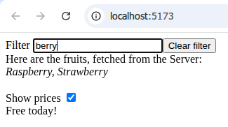

# React Deepwatch - automatically re-render on data changes

This framework eliminates the need to care about any state management or any code that tells a components that it's state has changed, like, i.e. the usually used `set**myVar's**State()` calls. 
Think of just having plain data, (_meaning: props, state, or business object inside your state. Or global data structures where your component uses some small parts of it_).   
If any of this data changes, React Deepwatch **detects those changes automatically and re-renders** the component and also re-runs [load(...) statements](#load) should they depend on that changed data. 
_These inline `load(...)` statements are the second cool trick that this library offers, which comes by as a benefit of this data awareness😎_

So how does it work? Can this even work? How is it possible to track all these reads and writes automatically?   
The answer: Javascript offers very powerful (and almost forgotten) language features with allows React Deepwatch to "virtualize" (or trap) every read/write in any data structure. 
On the one hand, there is the mighty [Proxy class](https://developer.mozilla.org/en-US/docs/Web/JavaScript/Reference/Global_Objects/Proxy) which can intercept and record all your React-component-function's reads and writes to the data once you hand it that proxy.
So your component-function will see and use all the data through glasses of proxies.  
But what about if you have existing global data objects that already exist and are passed to your component from the outside? Yes, this data is also tracked and reacts to external changes. This is achieved by other [various javascript tricks](https://github.com/bogeeee/proxy-facades/blob/main/origChangeTracking.ts).  
The proxy stuff and all these "tricks and traps" were abstracted away into [one coherent -and therefore well testable- core layer behind the scenes](https://github.com/bogeeee/proxy-facades). 
The good thing is, that all proxied and instrumented objects **act fully transparent**. You data structures behave exactly the same as a non tracked original would. You can as-usual operate on them by your functions or libraries😊 and React Deepwatch components (watchedComponents) integrate seamlessly in your existing React component tree and existing data graph. 


# Performance friendly  
  React Deepwatch **watches only those properties that are actually used** in your component function. It doesn't matter how complex and deep the graph (the data) behind your state or props is. 
  Only relevant values are watched and will trigger a re-render. And this only for relevant components, meaning not the whole tree under it, as you were used to with classic un-memoized React components.

# Quick example to show you the nice features
There are also other beneficial features that come with this lib.
Here are all basic features, put together into one example. Hope, you're not overwhelmed with it. Just imagine, what this component does, and how few code is needed to achieve it.




````jsx
// Will reload the fruits and show a 🌀 during load, if you type something in the filter box.
const MyComponent = watchedComponent(props => {
    const state = useWatchedState({
        filter: "",
        showPrices: false,
    })

    return <div>
        {/* A nice bind syntax. No more 'onChange(...)' code */}
        Filter      <input type="text"     {...bind(state.filter    )} />
        
        {/* Setting state.filter="" will automatically re-render and re-run the following server fetch, if necessary👍 */}
        <input type="button" value="Clear filter" onClick={() => state.filter = ""} />
        
        {/* you can fetch data from **inside** conditional render code or loops😎! No useEffect needed! Knows its dependencies automatically👍 */}        
        <div>Here are the fruits, fetched from the Server:<br/><i>{ load(async ()=> await fetchFruitsFromServer(state.filter), {fallback:"loading the list 🌀"} )}</i></div><br/>

        {/* Side note: The above load(...) code is **independent** of state.showPrices, react-deepwatch knows that automatically, so clicking here will NOT exec a re- load(...)👍... */}
        Show prices <input type="checkbox" {...bind(state.showPrices)} />
        {/* showing here, that clicking "show prices" will only do a re-render but not re-do the fetchFruitsFromServer: */}
        {state.showPrices?<div>Free today!</div>:null}
    </div>
});

createRoot(document.getElementById('root')).render(<MyComponent/>);
````
[](https://stackblitz.com/fork/github/bogeeee/react-deepwatch/tree/1.x/examples/less-loading-code?title=react-deepwatch%20example&file=index.jsx)

# Install
````bash
npm install --save react-deepwatch
````

# Usage

## Watched state
````jsx
import {watchedComponent, watched, useWatchedState} from "react-deepwatch"
          
const MyComponent = watchedComponent(props => {
    const state = useWatchedState( {myDeep: {counter: 0, b: 2}}, {/* WatchedOptions (optional) */} );

    return <div>
        Counter is: {state.myDeep.counter}<br/>
      <button onClick={ () => state.myDeep.counter++ /* will trigger a rerender */ }>Increase counter</button>
    </div>
}, {/* WatchedComponentOptions (optional) */});

<MyComponent/> // Use MyComponent
````
[](https://stackblitz.com/fork/github/bogeeee/react-deepwatch/tree/1.x/examples/no-more-setstate?title=react-deepwatch%20example&file=index.jsx)

`state` is now a Proxy. you can modify anything (deep) under it and the component get's re-rendered (when relevant).
You can also hand parts of the state to child components and let them modify it. No limits here.  

**Make sure, all sources to your component are watched** if you want them to trigger re-rendering: `props` are already automatically watched; For context, use `watched(useContext(...))`. For any external/global object, wrap it in `watched(myGlobalObject)`.  
So as a rule of thumb: Just wrap every (external) thing in `watch(...)`. Double watching does not hurt;)

## Load(...)

`load(...)` can async'ly **fetch data anywhere** inside your render code. You don't have to code any useEffect constructs around it anymore. 
Simply load data at exactly the point where you need it. That means, it can even can be inside a conditional block or a loop 👍.

````jsx
import {watchedComponent, load, poll, isLoading, loadFailed, preserve, READS_INSIDE_LOADER_FN} from "react-deepwatch"

const MyComponent = watchedComponent(props => {

    return <div>
        Here's something fetched from the Server: {  load( async () => await myFetchFromServer(props.myProperty), {/* LoadOptions (optional) */} )  }
    </div>
});

<MyComponent/> // Use MyComponent
````
[](https://stackblitz.com/fork/github/bogeeee/react-deepwatch/tree/1.x/examples/less-loading-code?title=react-deepwatch%20example&file=index.jsx)

The returned Promise will be await'ed and the component will be put into [suspense](https://react.dev/reference/react/Suspense) that long.
**`load(...)` re-executes `myFetchFromServer`, when a dependent value changes**. For this auto-dependency mechanic to work, again, **make sure, all sources to your component are watched**: `props` and other `load(...)`'s result are already automatically watched; For state, use `useWatchedState(...)`; For context, use  `watched(useContext(...))`.

### Dependencies
By default, everything prior to the load(...) statement in your code and immediately in your loaderFn is treated as a dependency. 
This is the perfectly safe and care free option for most use cases. But it can sometimes be too broad and lead to more reloads than necessary. Therefore, when you do performance sensitive fetches, you can fine-tune the dependencies:

<details>
  <summary>Fine-tuning your deps</summary>

Just like with React's `useEffect(..., [...yourDeps...])`, You can explicitly specify the deps in the LoadOptions#deps array. 
Additional, there is one special symbol which you can insert there:` READS_INSIDE_LOADER_FN`. This will treat trackable reads on objects in your loaderFn as dependencies. Examples:
````jsx
const someWatchedObj = ... //somehow derived (deeply) from props, watched(...) or useWatchedState(...) or load(...)
const showPrices = state.showPrices;

{load(async () => {return await fetchFruitsFromServer(showPrices)}) } // ✅ Auto dependencies. This will include the recorded "read" in the line 'const showPrices = state.showPrices;' and therefore reload when showPrices is different (=any determnistic value that's derived from the inputs till here, which covers everything you could need👍).
{load(async () => {return await fetchFruitsFromServer(state.showPrices         )}, {deps: [READS_INSIDE_LOADER_FN            ]}) } // ✅
{load(async () => {return await fetchFruitsFromServer(someWatchedObj.users.get("Axel").getPrefs().showPrices)}, {deps: [READS_INSIDE_LOADER_FN]}) } // ✅ Depending on properties, starting from **on** a watched object/Array/Set/Map or derived stuff is all tracked (Thanks to proxy-facades, it will follow and track this complete path of reads and watch for changes precisely there👍).
{load(async () => {return await fetchFruitsFromServer(showPrices               )}, {deps: [READS_INSIDE_LOADER_FN            ]}) } // ❌ Reading the closured variable showPrices is not trackable by react-deepwatch. It can only track reads **on** (proxied-) objects = You should see a `.` or a `[...]`
{load(async () => {return await fetchFruitsFromServer(showPrices               )}, {deps: [READS_INSIDE_LOADER_FN, showPrices]}) } // ✅ List showPrices additionally as depExplicitly. Note: READS_INSIDE_LOADER_FN is not needed here, but it doesn't hurt.

{load(async () => {
    const fruits = await fetchFruitsFromServer(); // Takes some time...
    return fruits.filter(f => f.indexOf(state.myFilter) >=0); // ❌ READS_INSIDE_LOADER_FN cant't catch the state.myFilter read, cause it did not happen **immediately** but after an async fork/not in the same sync block. You have to keep this in mind. Also for the auto-dependencies.  
}, {deps: [READS_INSIDE_LOADER_FN]}) }
````
</details>

### Show a 🌀loading spinner
To show a 🌀loading spinner / placeholder during load, either...
 - **wrap your component in a [`<Suspense fallback={<div>🌀</div>}>...<MyComponent/>...</Suspense>`](https://react.dev/reference/react/Suspense)**. It can be wrapped at any parent level😎. _Or..._
 - **call isLoading()** inside your component, to probe if any or a certain `load(...)`statement is loading. _See jsDoc for usage example. Mind the caveat of not using it for a condition to cut off a load statement._ _and/or..._   
 - **specify a fallback** value via `load(..., {fallback:"🌀"})`. You might return it in the form of your usual data as a quick cheap trick to get it displayed;)

### Handle errors
either...
 - **wrap your component in a** [`<ErrorBoundary fallback={<div>Something went wrong</div>}>...<MyComponent/>...</ErrorBoundary>`](https://github.com/bvaughn/react-error-boundary) from the [react-error-boundary](https://github.com/bvaughn/react-error-boundary) package. It can be wrapped at any parent level😎.  
   It tries to recover from errors and re- runs the `loaderFn`, whenever a dependency changes. Note that recovering works only with the mentioned [react-error-boundary 4.x](https://github.com/bvaughn/react-error-boundary) and not with 3rd party error-boundary libraries. _Or..._
 - **try/catch around the load(...)** statement. Caveat: You must check, if caught is `instanceof Promise` and re-throw it then. _Because this is the way for `load` to signal, that things are loading._ _Or..._
 - **call** the **loadFailed()** probing function. This looks more elegant than the above. _See jsDoc for usage example._

### Object instance preserving
Use the `preserve` function on all your fetched data, to smartly ensure non-changing object instances in your app. So to make sure, `newFetchResult` **===** `oldFetchResult`. It does this also for deeper objects. This is the better way, because changed object instances can either cascade to a lot of re-loads or result in bugs because your component is still watching an old instance.
  _Think of it like: The preserve function does for your data, what React does for your component tree: It smartly remembers the instances, if needed with the help of an id or key, and re-applies the re-fetched/re-rendered properties to them, so the object-identity/component-state stays the same._  
  👍 `load(...)` does `preserve` its result by default to enforce this paradigm and give you the best, trouble free experience.

### Caveats
- The component function might return and empty `</>` on the first load and **produce a short screen flicker**. This is [because React's Suspense mechasim is not able to remeber state at that time](https://react.dev/reference/react/Suspense#caveats). To circumvent this, specify `WatchedComponentOptions#fallback`.
- `<Suspense>` and `<ErrorBoundary>` inside your component function do not handle/catch loads in that **same** function. _Means: You must place them outside to handle/catch them._
- If your app is a mixed scenario with non-watchedComponents and relies on the old way of fully re-rendering the whole tree to pass deep model data (=more than using shallow, primitive props) to the leaves, mind disabling the WatchedComponentOptions#memo flag.
- SSR is not supported.
- [startTransition](https://react.dev/reference/react/startTransition) is not supported (has no effect).
- As said: Keep in mind that `load(...)` calls `preserve` on its result. It also invalidates (destroys) the "unused" objects. _When they're not really unused any you are trying to access them, You'll get the proper error message how to disable it_.

# And less... handing onChange listeners to child components
Since we have proxy-facades, we can easily hook on, whenever some deep data changes and don't need to manage that with callback- passing to child-child components.
Let's say, we have a form and a child component, that modifies it. We are interested in changes, so we can send the form content to the server.
````jsx
import {watchedComponent, watched, useWatchedState} from "react-deepwatch"
const MyParentComponent = watchedComponent(props => {
    const myState = useWatchedState({
        form: {
            name: "",
            address: ""
        }
    }, {onChange: () => console.log("Something deep inside myState has changed")}); // Option 1: You can hook here

    return <form>        
        <ChildComponentThatModifiesForm form={ // let's pass a special version of myState.form to the child component which calls our onChange handler
            watched(myState.form, {
                onChange: () => {postFormToTheSerer(myState.form); console.log("Somthing under myState.form was changed")} // Option 2: You can also hook here
            })
        }/>
    </form>
});
````
[](https://stackblitz.com/fork/github/bogeeee/react-deepwatch/tree/1.x/examples/onchange-handlers?title=react-deepwatch%20example&file=index.jsx)

_This example will trigger both onChange handlers._

_Note, that `watched(myState.form) !== myState.form`. It created a new proxy object in a new proxy-facade layer here, just for the purpose of deep-watching everything under it. Keep that in mind, when i.e. comparing objects by instance (I.e. row === selectedRow) if they arrived in different ways. Sometimes you may want to take advantage of it, so that modifications in the originaly layer (in MyParentComponent) won't fire the onChange event / call the postFormToTheSerer function. I.e. for updates that **came** from the server_

# {...bind}: Less onChange code for &lt;input/&gt; elements

Let's make the value binding code a bit easier:
````jsx
import {bind} from "react-deepwatch";

// Old:
<input type="text" value={myState.myValue} onChange={(event) => myState.myValue = event.how.was.that.again.i.just.want.the.value} />

// New:
<input type="text" {...bind(myState.myValue)} />
````
[](https://stackblitz.com/fork/github/bogeeee/react-deepwatch/tree/1.x/examples/bind?title=react-deepwatch%20example&file=index.jsx)

It works for all sorts of input types, not only text👍. Also with [MUI](https://mui.com/) and [Blueprint](https://blueprintjs.com) input components and should work in general with other library components as long as they stick to the standards.  

# Further notes

### watched
You can also use `watched` similarly  to `useWatchedState` to watch any global object. _But in React paradigm, this is rather rare, because values are usually passed as props into your component function._

### poll
Besides `load`, there's also the `poll` function, which works similar, but re-loads in regular intervals. _See jsDoc_

### Retsync
Besides `load`, react-deepwatch also supports hosting [retryable-synchronous](https://github.com/bogeeee/proxy-facades/blob/main/retsync.ts) code.

### [Deeper explanation of the mechanics](https://github.com/bogeeee/react-deepwatch/blob/main/react-deepwatch/mechanics.md)

### Similar libraries
There are also other libraries that address proxying the state:  
[valtio](https://github.com/pmndrs/valtio), [react-easy-state](https://github.com/RisingStack/react-easy-state), [wana](https://www.npmjs.com/package/wana),

**⭐⭐React Deepwatch set's its self apart in the following areas:⭐⭐**
- Deep (not only shallow-) proxying
- Tracking changes above **and** below the proxy = also on the unproxied object.
- Full transparent support for `this`, getters/setters (treated as white box), user's methods, Sets, Maps, Arrays _(wana seems to support Sets,Maps, Arrays too)_
- Very comprehensive `load(...)` concept with auto dependencies, fallbacks, probing functions, instance preserving mechanism, possible in conditionals/loops, supports polling, error boundaries.  
- &lt;Input/&gt;  bind(...)ing

### Simplify the server side as well
If you like, how this library simplifies things for you and want to write the backend (http) endpoints behind your load(...) statements simply as typescript methods, have a look at my flagship project [Restfuncs](https://github.com/bogeeee/restfuncs).
Example: 
````typescript
// In your watchedComponent function:
return <div>The greeting's result from server is: {  load( async () => await myRemoteSession.greet(state.name) )  }</div>

// On the server:
...
@remote greet(name: string) {
    return `Hello ${name}` 
}
...
````
_The example leaves away all the the setup-once boilerplate code.  
Also in your tsx, you can enjoy type awareness / type safety and IDE's code completion around `myRemoteSession.greet` and all its parameters and returned types, which is a feature that only rpc libraries can offer (Restfuncs is such one)😎_